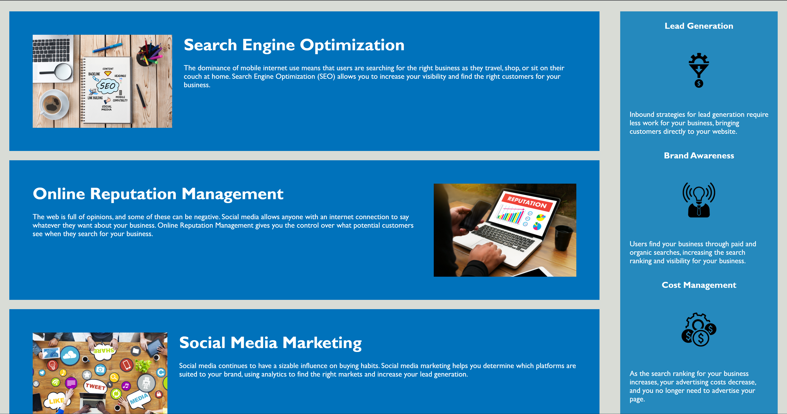

# hw1-semantic-markup

## Description

**Goal:** To refactor website to meet accessibility standards. Must be optimized for search engines.

Accessibility is a topic of increasing priority on the internet. The internet should be accessible to everyone, so our goal as web developers is to use our tools to let anyone access and interact with the content in our webpages. There are multiple assistive web technologies designed just for that purpose. This project focuses on using semantic elements to organize a web page independent of style and position. This process also helps websites rank higher in search engines; semantic elements help a search engine find the main content of a page. An accessible website leads to a better user experience and increased traffic.

## Refactor

1. Replaced `
` and `` elements with semantic elements like `<header>`, `<aside>`, `<nav>`, `<bdi>`, etc. Left class and id attributes that detailed content.
1. Added alt text to every image and icon.
1. Cleaned CSS. Collapsed repetitive selectors and attributes. Organized selectors to reflect web page layout.

[Deployed Webpage](https://supsha878.github.io/hw1-semantic-markup/)

